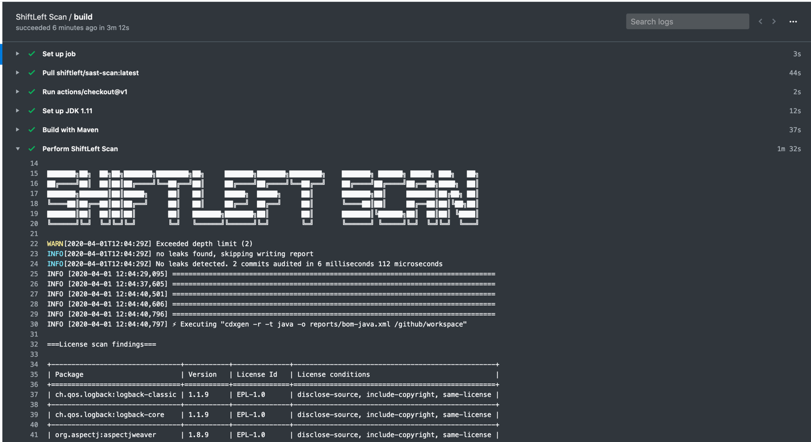
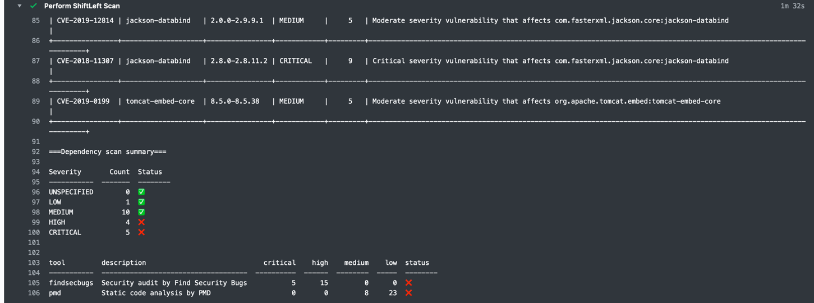

# Overview

ShiftLeft Inspect Pro is a free commercial-grade security tool for modern DevOps teams. With an integrated multi-scanner based design, Inspect Pro can detect various kinds of security flaws in your application and infrastructure code in a single fast scan. The product supports a range of integration options: from scanning every push via a git hook to scanning every build and pull-request in the CI/CD pipelines.

## Highlighted Features

### Supported scans

- Credentials Scanning to detect accidental secret leaks
- Static Analysis Security Testing (SAST) for a range of languages and frameworks
- Open-source dependencies audit
- License violation checks

### Languages supported

- Salesforce Apex
- bash
- Go
- Java
- JSP
- Node.js
- Oracle PL/SQL
- Python
- Rust (Dependency and Licence scan alone)
- Terraform
- Salesforce Visual Force
- Apache Velocity

## Getting Started

Simply add the following snippet to your GitHub action configuration.

```yaml
- name: Perform ShiftLeft Scan
  uses: ShiftLeftSecurity/scan-action@master
  with:
    type: "credscan,java,depscan"
```

Pass the various language types using the `type` parameter. Ignoring this parameter would enable automatic project type detection. You can find the scan summary printed directly on the console log.





The action also produces HTML reports for the various scans. To upload the reports as build artifacts to your pipeline use the `upload-artifact` step as shown:

```yaml
- name: Perform ShiftLeft Scan
  uses: ShiftLeftSecurity/scan-action@master
  with:
    type: "credscan,python"
  env:
    WORKSPACE: https://github.com/${{ github.repository }}/blob/${{ github.sha }}
    GITHUB_TOKEN: ${{ secrets.GITHUB_TOKEN }}

- uses: actions/upload-artifact@v1
  with:
    name: reports
    path: reports
```

In the above configuration, two environment variables are used to customise the behaviour:

- WORKSPACE: Specifying the URL to your repository would transform the filenames in the reports to hyperlinks
- GITHUB_TOKEN: Passing the GitHub token would improve the scan results by increasing the allowance for package names lookup during dependency scanning

## Documentation

Please refer to <LINK HERE> for the documentation on using ShiftLeft Inspect Pro in your pipelines.
